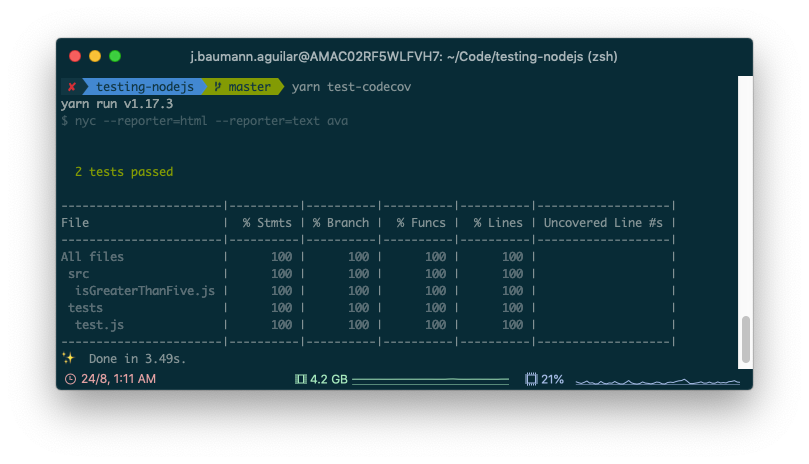

# 💯% Code coverage is useless

[](https://github.com/baumannzone/100-code-coverage-is-useless/actions)
[](https://coveralls.io/github/baumannzone/100-code-coverage-is-useless?branch=master)
[](https://app.netlify.com/sites/100-code-coverage-is-useless/deploys)

<!-- ALL-CONTRIBUTORS-BADGE:START - Do not remove or modify this section -->
[](#contributors-)
<!-- ALL-CONTRIBUTORS-BADGE:END -->
---


* [Live Demo](#demo--https---100-code-coverage-is-uselessnetlifyapp-)
* [Install](#install)
* [Run code](#run-code)
* [Run tests](#run-tests)
* [License](#license)
* [Contributors ✨](#contributors--)

> Code Coverage is a measurement of the percentage of code lines executed during the test suite.



## DEMO: 
https://100-code-coverage-is-useless.netlify.app/

## Install
```
npm install
```

## Run code
```
npm run start
```

## Run tests
```
# run tests
npm run test

# run tests & get coverage report
npm run test:coverage
```

## Aditional Info
- Test runner: [AVA](https://github.com/avajs/ava)
- Coverage report: https://istanbul.js.org/ 


## License
This material is available for private, non-commercial use under the GPL version 3. If you would like to use this material to conduct your own workshop, please contact me at [@baumannzone](https://twitter.com/baumannzone)

---

## Contributors ✨

Thanks goes to these wonderful people ([emoji key](https://allcontributors.org/docs/en/emoji-key)):

<!-- ALL-CONTRIBUTORS-LIST:START - Do not remove or modify this section -->
<!-- prettier-ignore-start -->
<!-- markdownlint-disable -->
<table>
  <tr>
    <td align="center"><a href="https://twitter.com/baumannzone"><br /><sub><b>Jorge Baumann</b></sub></a><br /><a href="https://github.com/baumannzone/100-code-coverage-is-useless/commits?author=baumannzone" title="Code">💻</a> <a href="https://github.com/baumannzone/100-code-coverage-is-useless/commits?author=baumannzone" title="Documentation">📖</a></td>
  </tr>
</table>

<!-- markdownlint-enable -->
<!-- prettier-ignore-end -->
<!-- ALL-CONTRIBUTORS-LIST:END -->

This project follows the [all-contributors](https://github.com/all-contributors/all-contributors) specification. Contributions of any kind welcome!
